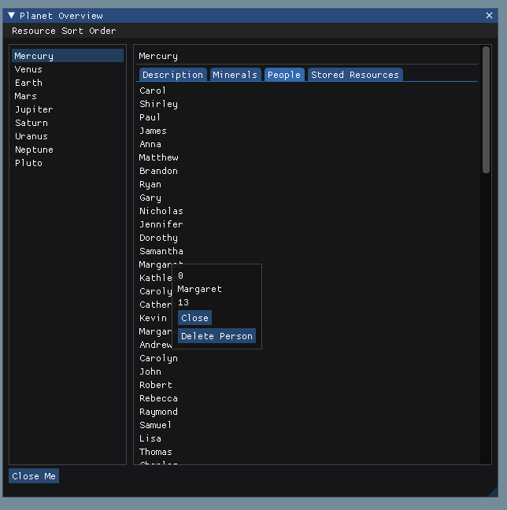
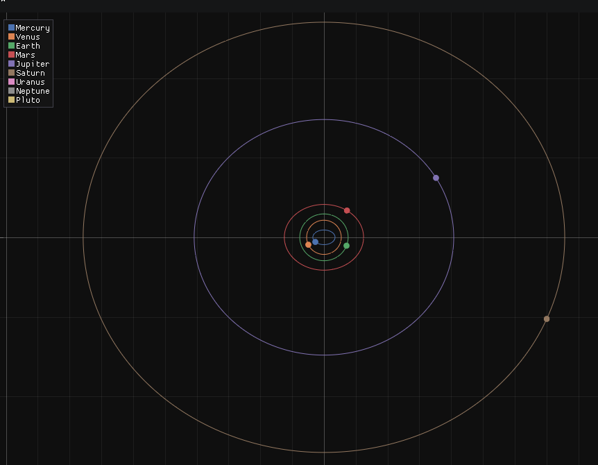

# Voyageur Game

This was a personal project, inspired by a [clone of Aurora](https://www.reddit.com/r/aurora/comments/x9apqz/voidal_an_aurora_clone_written_in_c_that_i_have/).
I have no intention of finishing it, 
I got the orbits within the solar system to work (excluding angle and position offsets) and then lost motivation to continue.

It's based off of the [ImGui](https://github.com/ocornut/imgui) and [ImPlot](https://github.com/epezent/implot) libraries (ImPlot seems to have a memory leak somewhere).
It uses DirectX11, but any of the demos from [the ImGui library](https://github.com/ocornut/imgui/tree/master/examples) should be able to be used as long as you keep lines 97/98 of GUI_Start.cpp

To use it, you should be able to just clone it and press run.

It uses CMake and C++ 20 to build.

There are (more than) a few bugs, the biggest one being the updates slowing way down if there isn't a _cout_ somewhere in the update code.
Very little attention was paid to ensuring consistent syntax with regards to camelCase and underscores. This was meant to be part of a refactor that never happened.

## Layout
### General

There is the main(), which is contained in Voyageur.cpp.
In here it starts two threads, one for the GUI and one for the game itself.
The game is just one big object that is instanced in the starting file, 
so that as the game thread updates it, the GUI can read the updates and display them.
There was a plan to do some more multithreading stuff (semaphores?) if the GUI became more interactive to block the GUI from updating the game as the game was updated.

### GUI

Within the GUI, everything is stored within the GUI folder
GUI_Start is basically where the GUI is instanced out, and as said above, based on the examples.
The only special thing done here is changing around the window name, around line 17-22. This is all the section that allows it to default to fullscreen.
The rest is all pretty self explanatory: 

The Game_Overview is the general window, which calls
everything else. 

SystemWindow provides a nice plot showing the orbits.

Gui_Top_Menu shows the top menu where save, etc. would normally be.

PlanetOverview shows some info about planets, including resources mined and people on it.

### Game

The MainGame calls everything else. It starts by getting all the different possible resources,
then it adds all the planets in the solar system.

To be able to uniquely identify each ID for planets and people, two approaches were taken.
The first (for people, see People.cpp) involved creating a class to manage a list of resources (people in this case).
 
The second (for planets) simply involved having an int that was updated each time a new resource (planet) was added.
 
Which way is better? 
 
No idea, just wanted to try both. Depends on the situation probably.

To update it, the Update function is called within MainGame, which runs through a number of different things.
Mainly the resources and planet locations are updated. 
Not going to go too far into it, it's all pretty well explained within the code I think.

## Sample Images

#### Full Screen

#### People Display

#### Solar System Overview Close Up
